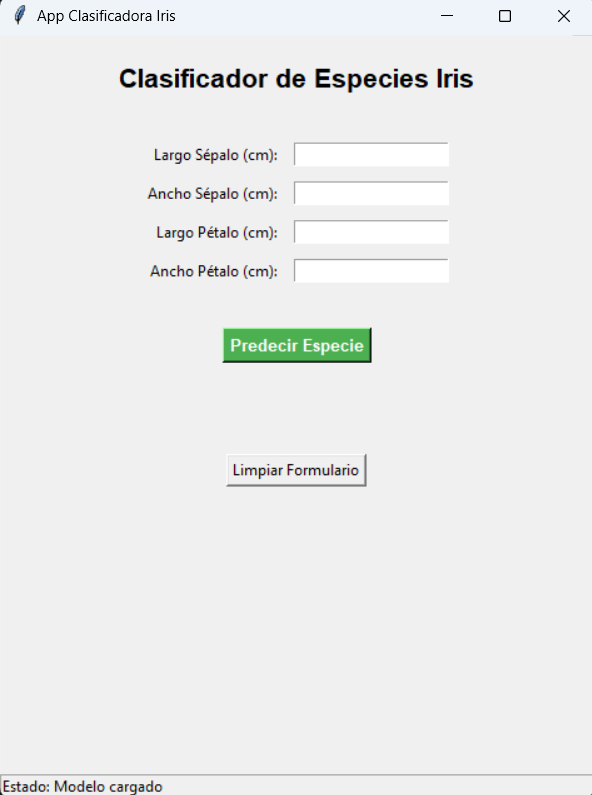
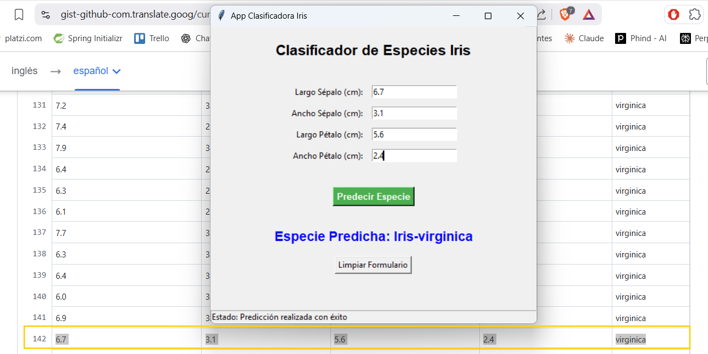

# Iris Classification App

Aplicación gráfica de clasificación de especies Iris utilizando Tkinter y Machine Learning.




## Descripción

**IrisApp** es una interfaz gráfica que implementa un clasificador de especies Iris basado en características botánicas:
- Largo del sépalo
- Ancho del sépalo
- Largo del pétalo
- Ancho del pétalo

El modelo predice una de tres especies: **Setosa**, **Versicolor** o **Virginica**.

## Requisitos

- Python 3.13+
- Gestor de dependencias: `uv`

## Instalación

### 1. Clonar o descargar el proyecto

```bash
git clone <repo-url>
cd TKinter
```

### 2. Instalar dependencias con uv

```bash
uv sync
```

Este comando:
- Lee `pyproject.toml` y `uv.lock`
- Crea el entorno virtual automáticamente
- Instala todas las dependencias necesarias

### 3. Activar el entorno virtual

**En Windows (PowerShell):**
```bash
.\.venv\Scripts\Activate.ps1
```

## Uso

Ejecutar la aplicación:

```bash
python IrisApp.py
```

### Pasos:
1. Ingresa las medidas en centímetros en los campos de entrada
2. Haz clic en **"Predecir Especie"**
3. Visualiza el resultado en el área de resultados
4. Usa **"Limpiar Formulario"** para resetear los campos

## Dependencias

- **joblib** >= 1.5.3 - Serialización de modelos ML
- **scikit-learn** >= 1.8.0 - Modelos y algoritmos de ML
- **pandas** >= 3.0.2 - Procesamiento de datos

## Estructura del Proyecto

```
TKinter/
├── IrisApp.py          # Aplicación principal
├── modelo.pkl          # Modelo entrenado (generado previamente)
├── pyproject.toml      # Configuración del proyecto
├── uv.lock             # Lock file de dependencias
└── README.md           # Este archivo
```

## Notas Técnicas

- El modelo debe estar guardado como `modelo.pkl` en el mismo directorio
- Los nombres de características esperadas:
  - `sepal length (cm)`
  - `sepal width (cm)`
  - `petal length (cm)`
  - `petal width (cm)`

---

## Conclusiones: Tkinter como Framework GUI

### Ventajas

1. **Simpleza**: Sintaxis clara y fácil de aprender
2. **Portable**: Viene incluido con Python, sin instalaciones extras en sistemas estándar
3. **Ligero**: Bajo consumo de recursos, ideal para aplicaciones pequeñas y medianas
4. **Rápido de prototipar**: Ideal para demostraciones y MVPs
5. **Integración natural**: Se integra perfectamente con librerías científicas (joblib, sklearn, pandas)

### Desventajas 

1. **Diseño anticuado**: La interfaz visual no se ve tan bien comparada con frameworks modernos
2. **Funcionalidades limitadas**: No tiene componentes complejos (gráficos avanzados, animaciones fluidas)
3. **Personalización difícil**: Temas y estilos son muy limitados
4. **No responsive**: La interfaz no se adapta bien a diferentes resoluciones
5. **Comunidad pequeña**: Menos recursos y librerías de terceros comparado con Qt o PyQt

### Apuntes finales

**Tkinter es excelente para:**
- Prototipos rápidos
- Aplicaciones de escritorio simples
- Herramientas internas y de administración
- Proyectos académicos
- Aplicaciones con interfaz básica sin requisitos visuales complejos

**No es recomendable para:**
- Aplicaciones de usuario final con alta demanda visual
- Aplicaciones complejas y escalables
- Proyectos que requieren themes personalizados

**Para este proyecto:** Tkinter fue la opción correcta. La aplicación es simple, funcional y cumple perfectamente su propósito sin necesidad de complejidad adicional.
